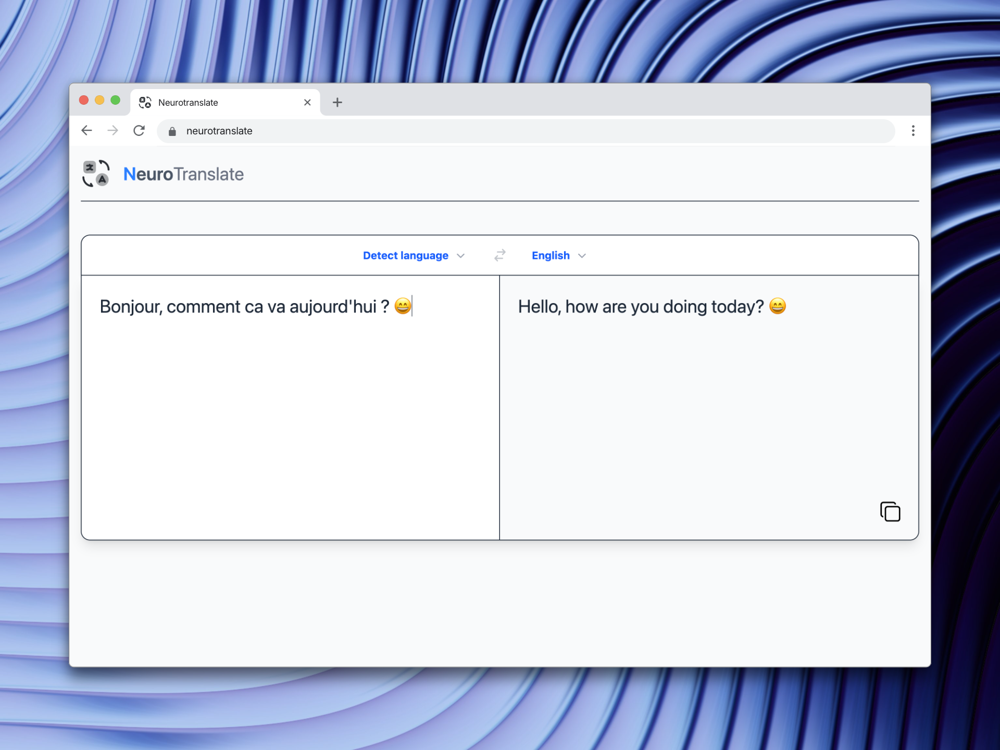

# NeuroTranslate [](https://github.com/Gautierpicon/NeuroTranslate/blob/main/LICENSE.md)

Open. Paste. Translate.

## Feedback

Feedback are welcome! Feel free to open an [issue](https://github.com/GautierPicon/NeuroTranslate/issues) or a [pull request](https://github.com/GautierPicon/NeuroTranslate/pulls) on the GitHub repository.

## Contribute / Run Locally

You will need to have [Bun](https://bun.sh/) installed.

Clone the project

```bash
git clone https://github.com/GautierPicon/NeuroTranslate
```

Go to the project directory

```bash
cd NeuroTranslate
```

Install dependencies

```bash
bun install
```

Download the model with Ollama

```bash
ollama run translategemma:4b
```

Start the server

```bash
bun run dev
```
